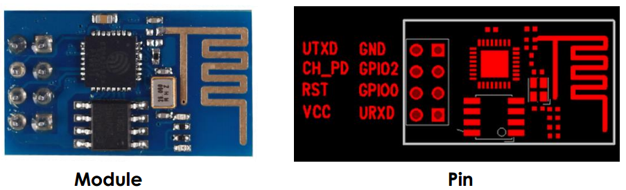

# ESP 8266 Garage Door Opener

Used to control a garage door with an ESP 8266 system.

## Material

### SunFounder ESP8266

  * Amazon: https://www.amazon.de/gp/product/B00U293Y5M
  * SunFounder wiki: https://www.sunfounder.com/wiki/index.php?title=Esp8266_Wifi_Module

### Eastern Computer ca-5 FT232RL FTDI Micro USB to Serial Converter

* Amazon: https://www.amazon.de/gp/product/B00QCCPCNK

### 3.3V Voltage Regulator Step-Down

* ebay: http://www.ebay.de/itm/272466294878

### Logic Level Converter

* Amazon: https://www.amazon.de/gp/product/B01B3KY6Q4

### 433MHz Receiver

* ebay: http://www.ebay.de/itm/272414344399

## Development Build

See http://www.xess.com/blog/esp8266-reflash/ for a dev board setup.

Note, since I didn't have a 3.3v USB to serial converter, I had to add the 3.3V voltage regulator.

## Final Build

* Full module with antenna (&lambda;/4 ~ 17cm)

* Pupulated board top view

* Unpopulated board top view

* board bottom view
